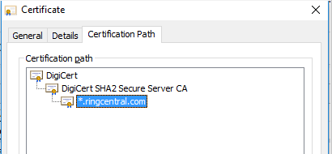

# 证书，证书链，CA的那些事

Kevin Chen - 铃盛软件Web Application Team

自从Google的Chrome从2018年7月起将所有的HTTP网站标记为不安全链接后，网站管理员没用HTTPS出门都不好意思跟人打招呼。
为了启用HTTPS，就需要有个私钥和证书，那证书和私钥是做什么的，为什么需要用到它们？要回答这个问题，需要先了解公开密钥体系以及HTTP和HTTPS的基本原理。

## 公开密钥算法
公开密钥算法是迄今为止安全领域最为重要的算法之一，其中最为著名和广泛使用的算法是RSA，它由三位数学家共同发明，RSA就是这三位数学家姓名的首字母缩写（Rivest、Shamir 和 Adleman）。
RSA加密算法非常可靠，除了暴力破解目前并没有发现有什么其他手段进行破译，以现在常用的2048位长的密钥为例，基本可以认为绝对安全。它使用一对密钥对即公钥和私钥，可以依据使用场景使用私钥加密公钥解密，
或者公钥加密私钥解密，公钥是公开的，私钥仅由所有人持有，因此它解决了对称加密算法密钥传输的难题。
RSA加解密的算法非常简单，大概有以下几个步骤：
 1. 首先需要找到一对大质数p和q, 两者相乘得到乘积n;
 2. 根据公式计算欧拉函数φ(n) = (p - 1)(q - 1);
 3. 找到一个大的随机数e，且与φ(n)互质，一般都使用65537;
 4. 根据欧拉公式计算d： e*d = 1 (mod φ(n))， 简单的说，就是 e和d的乘积除以欧拉函数，余数为1，公式可以变换为e*d - 1 = kφ(n)，k是倍数，可以通过辗转相除法进行求解.

从上面的几个步骤，我们可以得到几个数，n, e和d, (n, e)组成了公钥，(n, d)组成了私钥，从上面的公式可以看到，为了计算d，需要知道p和q，但只公开p和q的乘积n, 要进行因数分解是非常困难的一件事情，目前所知貌似只能用暴力破解。

RSA算法的推导需要用到数论知识，有兴趣的同学可以参考[RSA算法原理1](http://www.ruanyifeng.com/blog/2013/06/rsa_algorithm_part_one.html),[RSA算法原理2](http://www.ruanyifeng.com/blog/2013/07/rsa_algorithm_part_two.html)，我的数学早就还给了体育老师了，一看公式推导就头晕:)

假如要加密的信息是m，则加解密的算法如下：
* 加密：m^e = c (mod n)
* 解密：c^d = m (mod n)

这里要注意，加密信息m必须是正整数，且必须小于n，所以需要对要加密的内容要进行转换，比如字符转成对应的ASCII码等，从中也可以理解为什么RSA不适合大内容的加解密。

## HTTP是什么
HTTP是超文本传输协议（HyperText Transfer Protocol）的缩写，它是建立在TCP/IP基础上的一种明文传输协议，提供了GET, POST, PUT, DELETE, HEAD, PATCH和OPTIONS等请求协议，
划重点，它是一种明文传输协议，所以只要有人可以拦截HTTP请求，那么所传输的内容都暴露无遗。关于HTTP的完整知识可以参考[百度百科](HTTPS://baike.baidu.com/item/HTTP)。

## 为什么HTTPS比较安全
既然明文传输不安全，为了提高安全性，自然就想到了对传输的内容加密，没错，HTTPS就是一种加密传输协议，它是超文本传输安全协议（ Hypertext Transfer Protocol Secure）的缩写，
它在HTTP的基础上加入SSL/TLS协议层，想了解更多的细节可以参考[百度百科](HTTPS://baike.baidu.com/item/HTTPS)。

要对传输的内容加密，就需要用到加密算法，常用的加密算法有对称加密算法和非对称加密算法（公开密钥算法），我们知道对称加密算法具有稳定和速度快的特点，难点是如何可靠的传输加解密的密钥，而公开密钥算法通过密钥对，有效的解决了密钥传输的难题。
所以实践中，通过结合对称加密和非对称加密两种算法来解决数据传输的安全问题，简单的说，浏览器在和服务器协商阶段，确定加密算法，然后生成一个随机的对称加密密钥，用证书的公钥加密，
然后发送给服务器，只有服务器拥有私钥可以解密，服务器解密拿到对称加密的密钥后，后续的内容传输就用这个对称加密密钥来加解密，想了解HTTPS协议详细过程的可以自行Google，本文不再探讨这些细节。

爱思考的同学可能会问，为什么要整的这么麻烦，浏览器和服务器直接用公钥和私钥对传输的内容加解密，不行吗？答案是不行的，先不说RSA加解密比较慢，最主要还是因为公钥是公开的，任何人都可以拿到公钥，
浏览器用公钥加密后传给服务器，这个过程确实是安全的，因为只有服务器有私钥，但服务器发送给浏览器的内容用私钥加密，任何人只要拦截内容，然后用公钥就可以解密，那么服务端发送给浏览器的内容都是不安全的。

## 证明张三是张三
HTTPS使用公开密钥算法来传输对称加密密钥，并使用这个密钥加密传输的内容，看起来整个过程滴水不漏，但这里面还缺一个重要的环节。咱们天朝百姓以前经常遭受各种证明之苦，什么证明你爹是你爹之类的。
HTTPS请求的时候，公钥是由服务器推送给浏览器，那么浏览器怎么能确认这个公钥是服务器拥有的合法公钥呢，万一中间人攻击把公钥给换了呢，这是个很大问题。
浏览器也不可能把全世界所有的网站的公钥预先内置到发行包，或者每个用户访问某个网站的时候都从可靠渠道获取这个网站的公钥，想起来都是相当不靠谱的一件事。
这个时候人们就想到了给服务器的公钥开个证明，证明张三是张三，那该找谁开这个证明呢？嗯，这个时候该CA粉墨登场了。

## 神一样的CA
为了给服务器的公钥开个证明，我们需要一个权威的机构来颁发这个证明，CA（Certificate Authority - 数字证书认证中心）就是专门负责给公钥开证明的机构，所颁发的证明称为证书。
颁发证书是HTTPS安全极其重要的一环，所以颁发证书的CA机构必须绝对的可信，绝对的公平，不作恶，总之一句话，CA就是神一样的存在，如果你信任神，你就应该信任这些CA。

## 证书
当个人或者机构需要证书的时候，需要找CA机构申请证书，通常向CA机构发送一个证书请求文件CSR（Certificate Signing Request)，这个文件和正式的证书主要差别是没有签名，主要包含你是谁(Subject)和公钥等信息。
CA机构收到请求后，需要核实申请人的信息，核实无误后，就会用自己的私钥给待申请的证书签名，签名和证书的公钥以及Subject等信息一起打包（X.509格式）后，就是一张合法的证书。
申请人拿到证书后，就可以把这张证书和对应的私钥一起部署到自己的服务器上，浏览器发出HTTPS请求的时候，服务端就会把这张合法的证书推送给浏览器，浏览器接收后会进行一系列的校验。

## 证书验证过程，CA证书，证书链
浏览器接收到服务器证书后，为了验证证书是不是合法的，首先需要拿到签发该证书的私钥对应的公钥，这个公钥也是以证书的形式存在，俗称CA证书，最顶级的CA证书也称为根证书（自签名证书），这些证书都是由浏览器内置在发行包，
或者内置在操作系统的发行包作为信任链的终点。浏览器接收到服务器证书后，会根据证书中包含的签发CA机构信息，找到对应CA机构的CA证书，用它对证书的签名进行验证，同时还会验证证书绑定的域名，证书的有效期，以及证书的使用范围等等，
如果验证失败，则会报错并显示一个错误页面，提醒用户正在访问的网站是个高危不安全的网站，有些浏览器还允许手工添加例外（做之前请确保你清楚这么做可能的潜在后果）。

有些网站因为各种原因，使用的证书可能是某个未被浏览器信任的CA机构签发的，或者是自己签发的自签名证书，这种情况下需要自己导入根证书才能访问该网站，比如曾经的12306网站（现在12306已经使用商业证书了），
这么做的潜在风险是导入之后你将信任该CA机构签发的所有证书，更大的问题是，该CA可以伪造任何网站的证书，如果他们想干点坏事，就防不胜防了，所以强烈建议各位土豪朋友不要随意导入根证书，或是使用完及时删除。

各个顶级CA机构的根证书都内置在浏览器或者操作系统的发行包中，这些根证书当然可以使用来给客户签发证书请求，但实际中很少有CA机构这么干，原因在于如果某个根证书有问题，比如私钥泄露，基本上是灾难性的，
对应的CA根证书很快就会被各大浏览器和操作系统厂商移除，基本上不倒闭也去了半条命。所以大部分的顶级CA结构会用自己的根证书私钥签署一些二级（或多级）CA证书，然后用这些二级（或多级）CA证书的私钥给客户签发证书请求，
当某个二（多）级CA证书出幺蛾子的时候，只要把该二（多）级证书吊销就可以，波及面也不会那么大。

二级或多级CA证书也称为中间CA证书，引入中间CA证书之后，浏览器校验证书的过程也变的更复杂一些，举个例子，铃盛全球的网站[www.ringcentral.com](HTTPS://www.ringcentral.com)使用的证书是由“DigiCert SHA2 Secure Server CA" 签发的，
它是个二级CA证书，浏览器大致的验证过程如下:
* 浏览器解析证书的内容并提取关键信息；
* 检查证书“Subject”的CN属性或者“Subject Alternative Name”的属性与网站是否匹配;
* 通过“Issuer”或者“Authority Key Identifier”属性查找签署证书的CA证书, “Issuer”属性是跟CA证书的“Subject”对应，“Authority Key Identifier”是跟CA证书的“Subject Key Identifier”相对应；
* 浏览器确定了签署证书的CA证书后，就用这个CA证书的公钥来验证证书的签名；
* 循环以上步骤直到最后用来验证的CA证书是根证书，根证书也是自签名证书；
* 如果以上步骤都通过，并且根证书已经内置在浏览器或者操作系统中，则校验通过；

此外，浏览器还会针对证书的用途，有效期，以及证书是否被吊销等做检查，这些细节就不一一介绍了。

从上面的步骤可以看到浏览器在校验证书的过程中，从证书开始，会依次找到证书的签署CA证书，以及签发该CA证书的上级证书，一直到根证书也就是自签名证书，这样就形成了一个链，称为证书链，
通过证书查看工具可以看到这样一个树形结构：

## 证书链的检查和配置
市面上绝大多数服务器证书都是通过中间CA证书签署的，但只有很少一部分中间CA证书内置在浏览器或者操作系统中，这样浏览器在验证的时候，就有可能会遇到拿不到中间CA证书而导致校验失败。
我们曾经有个大客户反馈在使用铃盛服务的时候，通过单点登录系统有些终端（比如Android手机）不能登录，运维人员从铃盛的后台系统日志找不到任何错误信息，最后这个问题转到开发团队来。
客户的问题就是我们的问题，经过一番排查，发现问题是在单点登录跳回客户自己的IDP去做认证的时候，页面出不来，结合只有部分终端有问题，怀疑可能是证书链没配置好，果然通过openssl工具验证，发现服务器返回的证书链不完整从而导致有些终端没法验证证书链的有效性。

服务器返回的证书链不完整为什么会导致有些终端验证失败，有的终端验证又没有问题呢？原来不同平台的浏览器当发现服务器没有返回中间CA证书时，并没有统一的处理方式，有些浏览器比如windows平台或者IOS平台会根据证书中的“Authority Information Access"扩展字段提供的CA证书URL去自动下载中间CA证书，
从而完成证书链的校验，但有些平台，比如Android系统，如果服务器不返回中间CA证书，并不会去自动下载，而是直接报错。

检查证书链是否完整可以通过openssl命令来检查，网上也有很多在线的工具可以检查,例如：[https://www.ssllabs.com](https://www.ssllabs.com)，如果是openssl可以运行“openssl s_client -connect <domina>:443”进行检查,“domain”是你要检查的站点域名，比如：

为了保证浏览器证书链的校验，比较可靠的方式是在服务端配置好，如果使用Nginx的话，可以简单把服务器证书，中间CA证书按照顺序合并在同个文件就可以，证书文件一般是PEM格式，用普通的文本编辑器就可以打开并编辑。

## 证书种类
了解完浏览器是如何验证证书后，爱思考的同学可能会想，假如我们从某个权威CA申请一张我们服务器的证书，然后我们用自己证书对应的私钥签发新的证书，是不是也可以通过浏览器的证书链验证，如果这样的话，那岂不是人人可以签发证书，
安全性又如何得到保证呢？我刚开始也有这个疑问，后来经过深入的了解，其实证书本身包含很多扩展信息，其中有个关键信息是用来区分证书的用途，根据证书的用途，可以把证书分成两大类，即CA证书和普通服务器证书。

证书的扩展属性“Key Usage"和”Basic Constrains“共同确定一个证书是不是CA证书，如果是CA证书，”Key Usage“的”Certificate Signing“标志位必须为1，”Basic Constrains“标志位也必须为true，并通过“Path Length Constraint”来限制该CA证书是否可以签署下一级CA证书。
比如“Path Length Constraint=0”的CA证书，表示该CA证书只允许用于签署普通的证书，不允许签发下一级CA证书，如果Path Length Constraint=1， 说明该证书可以签发下一级CA证书，但新签发的下级CA证书的Path Length Constraint只能是“0”，它只能签署普通的证书。

普通的服务器证书按照安全级别分类，有DV（Domain Validation），OV（Organization Validation)和EV(Extended Validation),这三种证书实际使用上并没有太大区别，主要差别是它的安全级别以及申请时候的审核条件，最低级别的DV证书，只要你能向CA机构证明你拥有这个域名的管理权限就可以申请，
OV证书就相对严格的多，除了域名的管理权限外，还需要核实企业名称，地址电话等信息，最高级别的EV证书就非常的严格了（当然也相当的昂贵），除了这些常规检查，甚至要求金融机构出具证明，如果用的是EV证书，浏览器会在地址栏直接把企业的信息显示出来。
有兴趣的同学可以通过查看证书的"Certificate Policies"扩展属性查看，OID “2.23.140.1.1”代表EV证书，“2.23.140.1.2.2”代表OV证书， “2.23.140.1.2.1”表示这是个普通的DV证书，下面是Github网站的EV证书截图：

## HTTPS安全吗
我们大部分人的印象或所接受的信息都是HTTPS是非常安全的，因为它结合了公开密钥算法和对称加密算法，是不可破解的。从理论上讲，HTTPS是绝对安全的，为什么强调理论上呢？
如果还记得我们在前面部分的介绍，HTTPS有个重要的一环就是证明”张三是张三“，并且是通过权威的CA机构颁发的证书来证明所持公钥的合法性，在那节我们提到，
CA就是神，而顶级CA就是众神之神，这些神是绝对公平客观，不造假不作恶，对吧？那现实中这些神的表现又怎么样呢？
绝大部分的CA，尤其是顶级CA肯定是严格遵守规则的，否则一旦出问题，另外一个神浏览器和操作系统就会把他们的CA证书从信任列表移除，然后它们就得跌下神坛，离破产也不远了。
但除了顶级CA，还有相当多的中间CA机构，另外神也有打盹的时候啊，让我们一起回顾下面这些触目惊心的旧闻：

* 2011年3月，证书市场份额前列的科摩多（Comodo）公司遭黑客入侵，共9个数字证书被窃，包括：mail.google.com、addons.mozilla.org和login.yahoo.com 等。当时有人称那次事件为“CA版的 911攻击”；
* 同年荷兰CA提供商DigiNotar服务器被伊朗黑客攻破，黑客签发了包括Goolge，Facebook，美国中情局和军情六处等在内的531个网站证书，并用于窃听伊朗用户的Gmail等信息，该事件直接导致该公司在一年后破产，有兴趣可以查看这个[新闻链接](HTTPS://cnzhx.net/blog/diginotar-ca-servers-been-compromised/)；
* 除了被黑客入侵，还有自己作死的，比如有360背景的沃通，有兴趣可以查看这个[新闻](HTTPS://www.zhihu.com/question/50298017);
* 2013年，Google发现法国政府控制下的CA机构[ANSSI伪造证书](HTTPS://security.googleblog.com/2013/12/further-improving-digital-certificate.html)，这个事件在业界造成了极其恶劣的影响，斯诺登也披露美国中情局长期利用伪造的证书窃听用户的数据，法国和美国政府并不孤单，有兴趣的同学可以Goolge下CNNIC干过哪些事，以及它的背景，我就不多说了，怕有人查水表:)

我想不用列举更多的旧闻了，互联网并不完全，即使你使用了HTTPS，互联网不安全并不可怕，可怕的是我们处在一个不安全的环境而不自知。

## 证书透明度
通过一系列的事件，人们发现整个安全体系理论上看似乎无懈可击，实际上脆弱不堪，给人一种无力感，不少大牛包括一些互联网巨头开始关注并思考这个问题。Ben Laurie和Adam Langley首先构思了“证书透明度”，并将一个框架实现开发为开源项目，2013年3月，Google推出其首个证书透明度日志。
证书透明度是针对CA机构颁发证书的过程不透明而提出来的，俗话说，没有监督的权力是腐败的根源，要让权力在阳光下运行，这也是证书透明度的主要理念，它不是为了推翻CA，而是让证书的签发过程透明化，一旦有人造假或人为失误，将立即暴露在阳光下，无所遁形。

证书透明度主要有三个部分：
* 证书透明度日志(Certificate logs)
* 证书监控(Certificate monitors)
* 证书审计(Certificate auditors)

它的大致工作原理是：
1. 所有颁发的证书，都需要登记到证书透明度日志服务器（CA机构或用户自己都可以登记），登记后会得到一个唯一的SCT(Signed Certificate Timestamp)，日志服务器是基于“Merkle Tree”算法构建的，日志一经添加就永久存在，不可修改。“Merkle Tree”可能很多人不了解，但如果说起区块链，估计就没什么人不知道了，
区块链背后核心算法就是它。
2. 服务器返回证书的同时，需要同时返回“SCT”,Chrome会用内置的证书日志服务器证书验证SCT，如果没有SCT或者验证失败，会把网站标记成不安全网站。
3. 证书的所有人，可以定时监控自己的域名是不是在自己不知情的情况下被签发，Facebook把它内部开发的监控工具开放出来，站点管理员可以通过[Facebook的监控工具](HTTPS://developers.facebook.com/tools/ct/)很方便的对自己的站点进行监控，详情可[点击Facebook链接查看](HTTPS://www.facebook.com/notes/protect-the-graph/introducing-our-certificate-transparency-monitoring-tool/1811919779048165/)。
目前很多大公司包括Google和Facebook都开始监控自己的域名，Google曾经通过监控发现赛门铁克在Google不知情的情况下提交了一张预签发证书，如果你的网站是金融或电子商务网站，强烈建议把自己的域名加入监控。

目前Chrome和Safari浏览器都已经支持证书透明度校验，Firefox申明它将会尽快支持，另外Chrome结合实际情况也给尚不支持SCT的网站一个缓刑，就是2018年4月30号之前签发的证书不会给出警告，之后签发的证书，
如果你的网站没有返回SCT，将会被标记成不安全网站,有兴趣的同学可以打开Chrome的控制台进行查看（先打开控制台，后打开网址）：

## 后记
本来只想写一个短文普及下证书的知识，没想到解释完一个问题产生一个新的问题，越写越多，关于互联网的安全，给人的感觉是为了解决一个问题，然后引入更多的问题，道高一尺魔高一丈。

本文写作的另外一个动机是网上有很多以讹传讹的文章，比如证书包含公钥和私钥等，这是极大的谬误，如果真有人把公钥和私钥都包含在证书中，那将是非常可笑的一件事，实际上确实有同时包含公钥和私钥的文件，那是PKCS#12格式的文件，后缀名是".p12"或".pfx",它是CA机构颁发证书的时候，
同时生成公钥和私钥，签名完把证书和私钥打包成".p12"格式发回给申请人，申请人可以用openssl解析出证书和私钥文件，这种方式实际上有一定的安全性问题，至少CA机构知道了你的私钥（虽然它们号称会及时销毁私钥），另外EV证书不允许用这种方式申请，".p12"和证书实际上是两码事。

#参考文档

[How Certificate Transparency Works](HTTPS://www.certificate-transparency.org/how-ct-works)

[RFC 5280](HTTPS://tools.ietf.org/html/rfc5280)

[RSA算法原理1](http://www.ruanyifeng.com/blog/2013/06/rsa_algorithm_part_one.html)

[RSA算法原理2](http://www.ruanyifeng.com/blog/2013/07/rsa_algorithm_part_two.html)